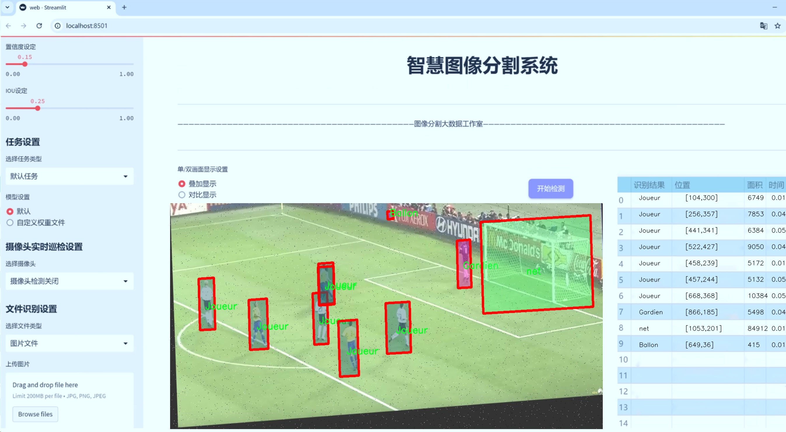
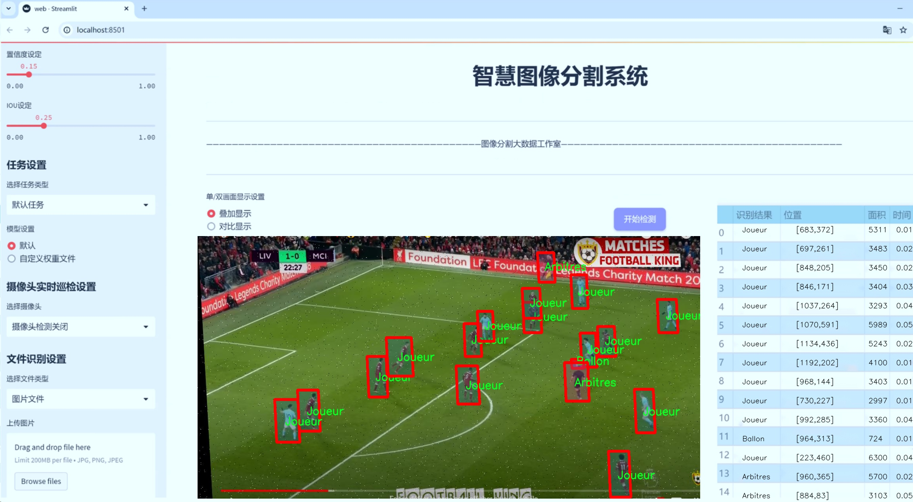
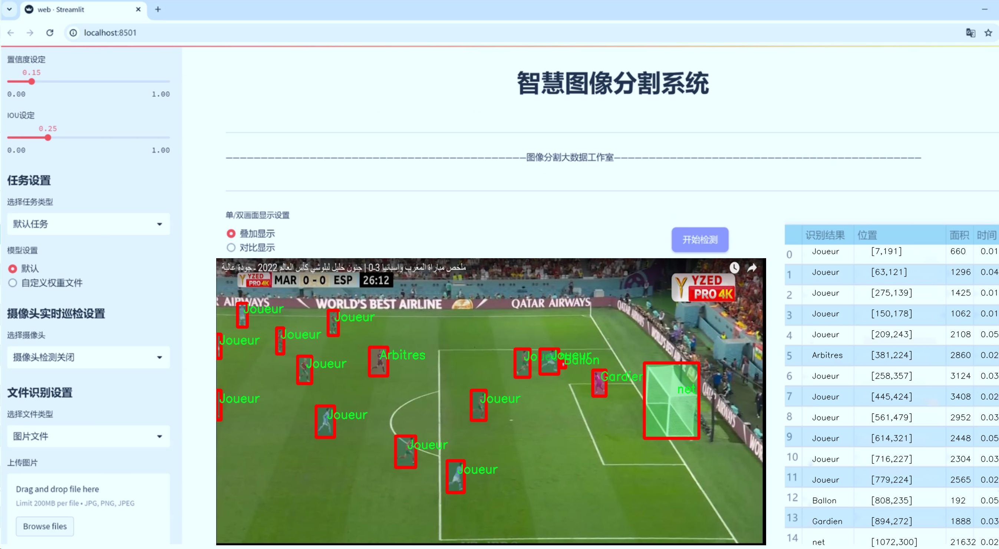
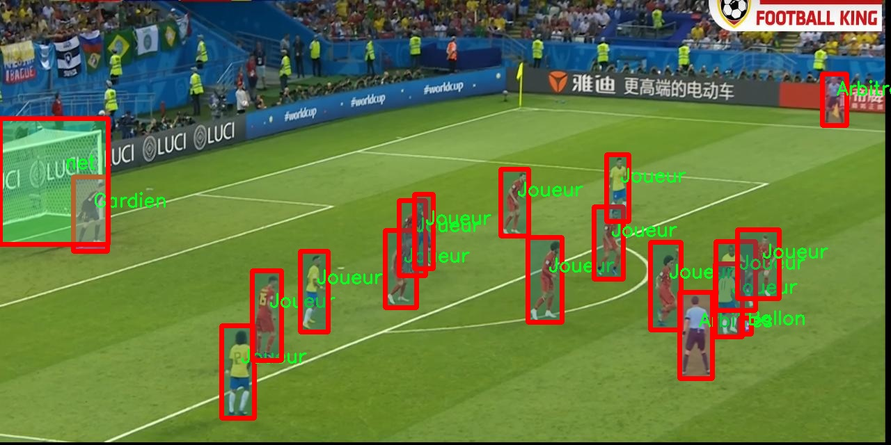
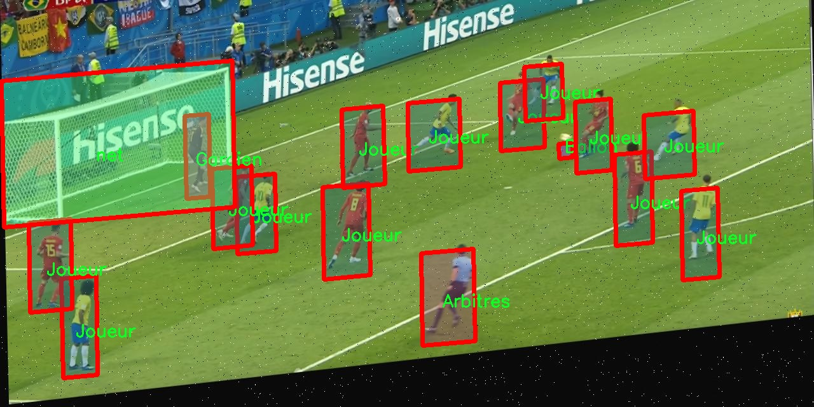
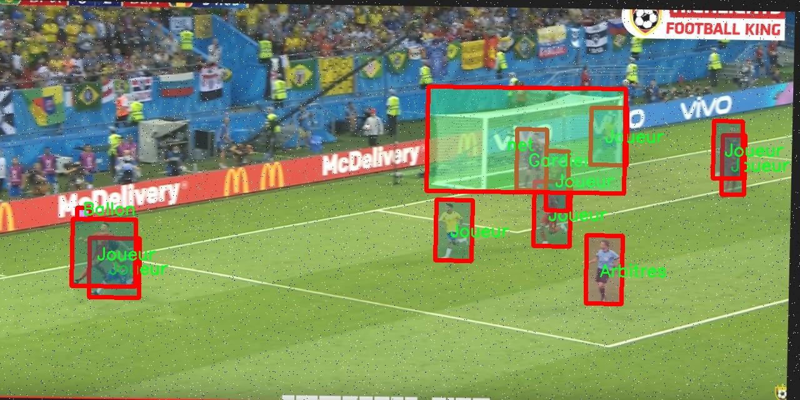
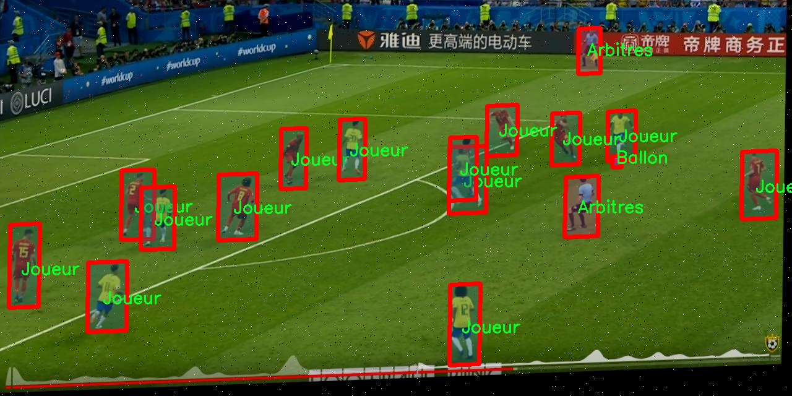
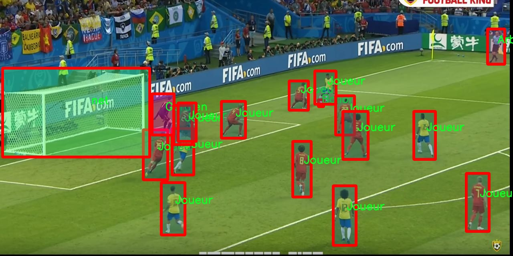

# 足球场景分割系统： yolov8-seg-C2f-EMBC

### 1.研究背景与意义

[参考博客](https://gitee.com/YOLOv8_YOLOv11_Segmentation_Studio/projects)

[博客来源](https://kdocs.cn/l/cszuIiCKVNis)

研究背景与意义

随着计算机视觉技术的迅猛发展，物体检测与分割在多个领域得到了广泛应用，尤其是在体育分析、智能监控和自动驾驶等领域。其中，足球作为全球最受欢迎的运动之一，其比赛场景的分析与理解对于教练、运动员以及观众都具有重要意义。通过对足球场景的精准分割与分析，可以为战术研究、运动员表现评估以及赛事回放提供重要的数据支持。因此，开发一个高效的足球场景分割系统显得尤为重要。

在众多物体检测与分割算法中，YOLO（You Only Look Once）系列模型因其高效性和实时性而受到广泛关注。YOLOv8作为该系列的最新版本，进一步提升了检测精度和速度，适合于复杂场景下的实时应用。然而，现有的YOLOv8模型在特定场景下的表现仍有提升空间，尤其是在多类别物体分割和细节处理方面。因此，基于改进YOLOv8的足球场景分割系统的研究，具有重要的学术价值和实际意义。

本研究将采用SoccerSee数据集，该数据集包含4800张图像，涵盖了六个类别：'Team2'、Arbitres（裁判）、Ballon（足球）、Gardien（守门员）、Joueur（球员）和net（球网）。这些类别的多样性为模型的训练和评估提供了丰富的样本，能够有效地反映足球比赛中的各种动态场景。通过对这些类别的精准分割，研究者可以深入分析比赛中的战术布置、球员的运动轨迹以及裁判的判罚行为等，从而为足球战术研究提供数据支持。

此外，改进YOLOv8模型的研究不仅限于提高分割精度，还包括优化模型的推理速度和资源消耗，使其能够在实时应用中表现出色。这对于直播赛事分析、即时战术调整以及球迷互动体验等方面都有着重要的推动作用。通过将深度学习与足球场景分析相结合，本研究有望为智能体育分析系统的发展提供新的思路和方法。

在实际应用层面，基于改进YOLOv8的足球场景分割系统能够为教练团队提供实时的战术分析工具，帮助他们更好地理解比赛动态，制定相应的战术调整。同时，球迷也能够通过这一系统获得更为丰富的比赛信息，提升观赛体验。此外，该系统还可以为足球训练提供数据支持，帮助运动员在训练中更好地理解战术和技术要点。

综上所述，基于改进YOLOv8的足球场景分割系统的研究，不仅具有重要的理论意义，也为实际应用提供了广阔的前景。通过对足球场景的深入分析，研究者可以为体育科学、人工智能和数据分析等多个领域的交叉研究提供新的视角和方法，推动相关领域的进一步发展。

### 2.图片演示







注意：本项目提供完整的训练源码数据集和训练教程,由于此博客编辑较早,暂不提供权重文件（best.pt）,需要按照6.训练教程进行训练后实现上图效果。

### 3.视频演示

[3.1 视频演示](https://www.bilibili.com/video/BV14CzRYBESK/)

### 4.数据集信息

##### 4.1 数据集类别数＆类别名

nc: 6
names: ['-Team2-', 'Arbitres', 'Ballon', 'Gardien', 'Joueur', 'net']


##### 4.2 数据集信息简介

数据集信息展示

在本研究中，我们使用了名为“SoccerSee”的数据集，以改进YOLOv8-seg在足球场景中的分割性能。该数据集专门针对足球比赛的各种元素进行了标注，涵盖了多个关键类别，共计六个类别。这些类别分别是：球队（-Team2-）、裁判（Arbitres）、足球（Ballon）、守门员（Gardien）、球员（Joueur）以及球网（net）。这些类别的选择不仅反映了足球比赛的基本构成要素，也为训练和评估分割模型提供了丰富的上下文信息。

“SoccerSee”数据集的设计考虑到了足球场景的复杂性和多样性，旨在为计算机视觉任务提供高质量的训练样本。每个类别都经过精确的标注，确保模型能够在实际应用中有效识别和分割不同的对象。例如，球队的标注不仅包括球员的外观特征，还考虑了他们在场上的相对位置和动态行为；裁判的标注则关注于他们在比赛中的角色和动作，这对于理解比赛的进程至关重要。

足球作为一项全球广受欢迎的运动，其场景中的元素往往具有高度的动态性和复杂性。通过使用“SoccerSee”数据集，我们能够捕捉到比赛中快速变化的状态，例如球员的移动、球的轨迹以及裁判的判罚动作。这些信息的整合为YOLOv8-seg模型的训练提供了丰富的上下文，使其在分割任务中表现得更加精准和高效。

在数据集的构建过程中，研究团队注重多样性和代表性，确保数据集中的样本涵盖了不同的比赛场景、天气条件和时间段。这种多样性不仅增强了模型的泛化能力，还使其能够在各种实际应用场景中表现出色。此外，数据集的图像质量经过严格筛选，确保每一帧图像都具有足够的清晰度和细节，以便于模型学习。

为了进一步提升模型的性能，我们在训练过程中采用了数据增强技术，以模拟不同的环境变化和视觉效果。这些技术包括随机裁剪、旋转、颜色变换等，旨在增加训练样本的多样性，帮助模型更好地适应现实世界中的各种情况。

在模型评估阶段，我们将使用“SoccerSee”数据集中的独立测试集进行性能验证，以确保模型在真实场景中的应用效果。通过对比模型在不同类别上的分割精度，我们能够识别出模型的优势和不足之处，从而为后续的优化提供依据。

总之，“SoccerSee”数据集为改进YOLOv8-seg的足球场景分割系统提供了坚实的基础。通过对足球比赛中关键元素的细致标注和多样化的样本选择，该数据集不仅增强了模型的学习能力，也为未来的研究和应用奠定了良好的基础。随着模型性能的不断提升，我们期待在足球场景的自动分析和理解方面取得更大的突破。











### 5.项目依赖环境部署教程（零基础手把手教学）

[5.1 环境部署教程链接（零基础手把手教学）](https://www.bilibili.com/video/BV1jG4Ve4E9t/?vd_source=bc9aec86d164b67a7004b996143742dc)


[5.2 安装Python虚拟环境创建和依赖库安装视频教程链接（零基础手把手教学）](https://www.bilibili.com/video/BV1nA4VeYEze/?vd_source=bc9aec86d164b67a7004b996143742dc)

### 6.手把手YOLOV8-seg训练视频教程（零基础手把手教学）

[6.1 手把手YOLOV8-seg训练视频教程（零基础小白有手就能学会）](https://www.bilibili.com/video/BV1cA4VeYETe/?vd_source=bc9aec86d164b67a7004b996143742dc)


按照上面的训练视频教程链接加载项目提供的数据集，运行train.py即可开始训练



     Epoch   gpu_mem       box       obj       cls    labels  img_size
     1/200     0G   0.01576   0.01955  0.007536        22      1280: 100%|██████████| 849/849 [14:42<00:00,  1.04s/it]
               Class     Images     Labels          P          R     mAP@.5 mAP@.5:.95: 100%|██████████| 213/213 [01:14<00:00,  2.87it/s]
                 all       3395      17314      0.994      0.957      0.0957      0.0843

     Epoch   gpu_mem       box       obj       cls    labels  img_size
     2/200     0G   0.01578   0.01923  0.007006        22      1280: 100%|██████████| 849/849 [14:44<00:00,  1.04s/it]
               Class     Images     Labels          P          R     mAP@.5 mAP@.5:.95: 100%|██████████| 213/213 [01:12<00:00,  2.95it/s]
                 all       3395      17314      0.996      0.956      0.0957      0.0845

     Epoch   gpu_mem       box       obj       cls    labels  img_size
     3/200     0G   0.01561    0.0191  0.006895        27      1280: 100%|██████████| 849/849 [10:56<00:00,  1.29it/s]
               Class     Images     Labels          P          R     mAP@.5 mAP@.5:.95: 100%|███████   | 187/213 [00:52<00:00,  4.04it/s]
                 all       3395      17314      0.996      0.957      0.0957      0.0845


### 7.50+种全套YOLOV8-seg创新点加载调参实验视频教程（一键加载写好的改进模型的配置文件）

[7.1 50+种全套YOLOV8-seg创新点加载调参实验视频教程（一键加载写好的改进模型的配置文件）](https://www.bilibili.com/video/BV1Hw4VePEXv/?vd_source=bc9aec86d164b67a7004b996143742dc)

### YOLOV8-seg算法简介

原始YOLOv8-seg算法原理

YOLOv8-seg算法是YOLO系列中的一个重要变种，专注于目标检测与分割任务的结合，旨在提升在复杂场景下的物体识别与定位能力。该算法在YOLOv8的基础上进行了深度优化，采用了更为先进的卷积神经网络架构，融合了目标检测与实例分割的特性，使其在处理多样化图像时表现出色。

YOLOv8-seg的核心思想是将整个图像作为输入，通过单一的神经网络同时进行目标检测和分割。这一过程依赖于YOLOv8的高效特征提取能力，能够快速生成图像的特征图，并通过一系列卷积层提取出丰富的上下文信息。相较于传统的分割方法，YOLOv8-seg的优势在于其高效性和实时性，能够在保持高精度的同时，实现快速的处理速度，适用于实时监控、自动驾驶等场景。

在网络结构上，YOLOv8-seg延续了YOLOv8的跨级结构（Cross Stage Partial, CSP）设计理念，进一步优化了特征提取模块。具体而言，YOLOv8-seg将YOLOv5中的C3模块替换为更轻量的结构，以减少计算量并提高推理速度。同时，算法保留了空间金字塔池化模块，这一设计使得网络能够有效地处理不同尺度的目标，增强了模型对多尺度物体的适应能力。

YOLOv8-seg还引入了新的损失函数策略，以提升分割精度。算法采用变焦损失来计算分类损失，同时结合数据平均保真度损失和完美交并比损失来优化边界框的回归过程。这种多层次的损失计算方式使得模型在训练过程中能够更好地捕捉目标的形状与边界信息，从而实现更为精准的分割效果。

在数据处理方面，YOLOv8-seg利用了多尺度训练和测试策略，进一步提升了模型的鲁棒性。通过在不同尺度下进行训练，模型能够学习到更为丰富的特征表示，从而在面对复杂背景和不同光照条件时，依然能够保持较高的检测与分割精度。此外，YOLOv8-seg还采用了数据增强技术，以增加训练样本的多样性，提升模型的泛化能力。

值得一提的是，YOLOv8-seg在处理实例分割任务时，采用了掩膜生成的方式。通过对目标区域进行精确的像素级标注，模型能够输出每个目标的精确轮廓。这一特性使得YOLOv8-seg在图像分割任务中表现出色，能够有效地分离重叠目标，提供更为细致的分割结果。

YOLOv8-seg的应用场景广泛，包括但不限于智能监控、医学影像分析、自动驾驶、工业检测等。在智能监控领域，YOLOv8-seg能够实时识别并分割出监控画面中的人、车等目标，为安全监控提供有力支持。在医学影像分析中，该算法能够帮助医生快速识别病灶区域，提高诊断效率。在自动驾驶领域，YOLOv8-seg能够实时识别道路上的行人、车辆及其他障碍物，为自动驾驶系统提供必要的环境感知能力。

总的来说，YOLOv8-seg算法通过对YOLOv8的多项改进，成功实现了目标检测与实例分割的有机结合。其高效的特征提取能力、先进的损失计算策略以及灵活的数据处理方式，使得该算法在多种应用场景中展现出优异的性能。随着计算机视觉技术的不断发展，YOLOv8-seg有望在未来的研究与应用中发挥更大的作用，为各类智能系统提供更为精准和高效的视觉识别能力。


### 9.系统功能展示（检测对象为举例，实际内容以本项目数据集为准）

图9.1.系统支持检测结果表格显示

  图9.2.系统支持置信度和IOU阈值手动调节

  图9.3.系统支持自定义加载权重文件best.pt(需要你通过步骤5中训练获得)

  图9.4.系统支持摄像头实时识别

  图9.5.系统支持图片识别

  图9.6.系统支持视频识别

  图9.7.系统支持识别结果文件自动保存

  图9.8.系统支持Excel导出检测结果数据


### 10.50+种全套YOLOV8-seg创新点原理讲解（非科班也可以轻松写刊发刊，V11版本正在科研待更新）

#### 10.1 由于篇幅限制，每个创新点的具体原理讲解就不一一展开，具体见下列网址中的创新点对应子项目的技术原理博客网址【Blog】：


[10.1 50+种全套YOLOV8-seg创新点原理讲解链接](https://gitee.com/qunmasj/good)

#### 10.2 部分改进模块原理讲解(完整的改进原理见上图和技术博客链接)【如果此小节的图加载失败可以通过CSDN或者Github搜索该博客的标题访问原始博客，原始博客图片显示正常】
### YOLOv8简介
YOLOv8 尚未发表论文，因此我们无法直接了解其创建过程中进行的直接研究方法和消融研究。话虽如此，我们分析了有关模型的存储库和可用信息，以开始记录 YOLOv8 中的新功能。

如果您想自己查看代码，请查看YOLOv8 存储库并查看此代码差异以了解一些研究是如何完成的。

在这里，我们提供了有影响力的模型更新的快速总结，然后我们将查看模型的评估，这不言自明。

GitHub 用户 RangeKing 制作的下图显示了网络架构的详细可视化。


在这里插入图片描述


在这里插入图片描述

YOLOv8 架构，GitHub 用户 RangeKing 制作的可视化

无锚检测
YOLOv8 是一个无锚模型。这意味着它直接预测对象的中心而不是已知锚框的偏移量。


YOLO中anchor box的可视化

锚框是早期 YOLO 模型中众所周知的棘手部分，因为它们可能代表目标基准框的分布，而不是自定义数据集的分布。


YOLOv8 的检测头，在netron.app中可视化

Anchor free 检测减少了框预测的数量，从而加速了非最大抑制 (NMS)，这是一个复杂的后处理步骤，在推理后筛选候选检测。


YOLOv8 的检测头，在netron.app中可视化

新的卷积
stem 的第一个6x6conv 被替换为 a 3x3，主要构建块被更改，并且C2f替换了C3。该模块总结如下图，其中“f”是特征数，“e”是扩展率，CBS是由a Conv、a BatchNorm、a组成的block SiLU。

在中， （两个具有剩余连接的 3x3C2f的奇特名称）的所有输出都被连接起来。而在仅使用最后一个输出。Bottleneck``convs``C3``Bottleneck


新的 YOLOv8C2f模块

这Bottleneck与 YOLOv5 中的相同，但第一个 conv 的内核大小从更改1x1为3x3. 从这些信息中，我们可以看到 YOLOv8 开始恢复到 2015 年定义的 ResNet 块。

在颈部，特征直接连接而不强制使用相同的通道尺寸。这减少了参数数量和张量的整体大小。

### 空间和通道重建卷积SCConv
参考该博客提出的一种高效的卷积模块，称为SCConv (spatial and channel reconstruction convolution)，以减少冗余计算并促进代表性特征的学习。提出的SCConv由空间重构单元(SRU)和信道重构单元(CRU)两个单元组成。

（1）SRU根据权重分离冗余特征并进行重构，以抑制空间维度上的冗余，增强特征的表征。

（2）CRU采用分裂变换和融合策略来减少信道维度的冗余以及计算成本和存储。

（3）SCConv是一种即插即用的架构单元，可直接用于替代各种卷积神经网络中的标准卷积。实验结果表明，scconvo嵌入模型能够通过减少冗余特征来获得更好的性能，并且显著降低了复杂度和计算成本。


SCConv如图所示，它由两个单元组成，空间重建单元(SRU)和通道重建单元(CRU)，以顺序的方式放置。具体而言，对于瓶颈残差块中的中间输入特征X，首先通过SRU运算获得空间细化特征Xw，然后利用CRU运算获得信道细化特征Y。SCConv模块充分利用了特征之间的空间冗余和通道冗余，可以无缝集成到任何CNN架构中，以减少中间特征映射之间的冗余并增强CNN的特征表示。

#### SRU单元用于空间冗余


为了利用特征的空间冗余，引入了空间重构单元(SRU)，如图2所示，它利用了分离和重构操作。

分离操作 的目的是将信息丰富的特征图与空间内容对应的信息较少的特征图分离开来。我们利用组归一化(GN)层中的比例因子来评估不同特征图的信息内容。具体来说，给定一个中间特征映射X∈R N×C×H×W，首先通过减去平均值µ并除以标准差σ来标准化输入特征X，如下所示:


其中µ和σ是X的均值和标准差，ε是为了除法稳定性而加入的一个小的正常数，γ和β是可训练的仿射变换。

GN层中的可训练参数\gamma \in R^{C}用于测量每个批次和通道的空间像素方差。更丰富的空间信息反映了空间像素的更多变化，从而导致更大的γ。归一化相关权重W_{\gamma} \in R^{C}由下面公式2得到，表示不同特征映射的重要性。


然后将经Wγ重新加权的特征映射的权值通过sigmoid函数映射到(0,1)范围，并通过阈值进行门控。我们将阈值以上的权重设置为1，得到信息权重W1，将其设置为0，得到非信息权重W2(实验中阈值设置为0.5)。获取W的整个过程可以用公式表示。


最后将输入特征X分别乘以W1和W2，得到两个加权特征:信息量较大的特征X_{1}^{\omega }和信息量较小的特征X_{2}^{\omega }。这样就成功地将输入特征分为两部分:X_{1}^{\omega }具有信息量和表达性的空间内容，而X_{2}^{\omega }几乎没有信息，被认为是冗余的。

重构操作 将信息丰富的特征与信息较少的特征相加，生成信息更丰富的特征，从而节省空间空间。采用交叉重构运算，将加权后的两个不同的信息特征充分结合起来，加强它们之间的信息流。然后将交叉重构的特征X^{\omega1}和X^{\omega2}进行拼接，得到空间精细特征映射X^{\omega}。从后过程表示如下：


其中⊗是逐元素的乘法，⊕是逐元素的求和，∪是串联。将SRU应用于中间输入特征X后，不仅将信息特征与信息较少的特征分离，而且对其进行重构，增强代表性特征，抑制空间维度上的冗余特征。然而，空间精细特征映射X^{\omega}在通道维度上仍然是冗余的。

#### CRU单元用于通道冗余


分割 操作将输入的空间细化特征X^{\omega}分割成两个部分，一部分通道数是\alpha C，另一部分通道数是(1-\alpha) C，随后对两组特征的通道数使用1 * 1卷积核进行压缩，分别得到X_{up}和X_{low}。

转换 操作将输入的X_{up}作为“富特征提取”的输入，分别进行GWC和PWC，然后相加得到输出Y1，将输入X_{low}作为“富特征提取”的补充，进行PWC，得到的记过和原来的输入取并集得到Y2。

融合 操作使用简化的SKNet方法来自适应合并Y1和Y2。具体说是首先使用全局平均池化将全局空间信息和通道统计信息结合起来，得到经过池化的S1和S2。然后对S1和S2做Softmax得到特征权重向量\beta _{1}和\beta _{2}，最后使用特征权重向量得到输出Y = \beta _{1}*Y_{1} + \beta _{2}*Y_{2}，Y即为通道提炼的特征。


### 11.项目核心源码讲解（再也不用担心看不懂代码逻辑）

#### 11.1 ui_style.py

以下是对代码的核心部分进行提炼和详细注释的结果：

```python
import base64
import streamlit as st

# 读取二进制文件并转换为 Base64 编码
def get_base64_of_bin_file(bin_file):
    # 以二进制模式打开文件
    with open(bin_file, 'rb') as file:
        data = file.read()  # 读取文件内容
    # 将读取的二进制数据进行 Base64 编码并解码为字符串
    return base64.b64encode(data).decode()

# 定义 Streamlit 应用的 CSS 样式
def def_css_hitml():
    st.markdown("""
        <style>
        /* 全局样式设置 */
        .css-2trqyj, .css-1d391kg, .st-bb, .st-at {
            font-family: 'Gill Sans', 'Gill Sans MT', Calibri, 'Trebuchet MS', sans-serif;  /* 设置字体 */
            background-color: #cadefc;  /* 设置背景颜色 */
            color: #21618C;  /* 设置字体颜色 */
        }

        /* 按钮样式 */
        .stButton > button {
            border: none;  /* 去掉边框 */
            color: white;  /* 字体颜色为白色 */
            padding: 10px 20px;  /* 设置内边距 */
            text-align: center;  /* 文本居中 */
            text-decoration: none;  /* 去掉下划线 */
            display: inline-block;  /* 使按钮为块级元素 */
            font-size: 16px;  /* 设置字体大小 */
            margin: 2px 1px;  /* 设置外边距 */
            cursor: pointer;  /* 鼠标悬停时显示为手型 */
            border-radius: 8px;  /* 设置圆角 */
            background-color: #9896f1;  /* 设置背景颜色 */
            box-shadow: 0 2px 4px 0 rgba(0,0,0,0.2);  /* 设置阴影效果 */
            transition-duration: 0.4s;  /* 设置过渡效果时间 */
        }
        .stButton > button:hover {
            background-color: #5499C7;  /* 鼠标悬停时背景颜色变化 */
            color: white;  /* 鼠标悬停时字体颜色 */
            box-shadow: 0 8px 12px 0 rgba(0,0,0,0.24);  /* 鼠标悬停时阴影效果变化 */
        }

        /* 侧边栏样式 */
        .css-1lcbmhc.e1fqkh3o0 {
            background-color: #154360;  /* 设置侧边栏背景颜色 */
            color: #FDFEFE;  /* 设置侧边栏字体颜色 */
            border-right: 2px solid #DDD;  /* 设置右边框 */
        }

        /* 表格样式 */
        table {
            border-collapse: collapse;  /* 合并边框 */
            margin: 25px 0;  /* 设置外边距 */
            font-size: 18px;  /* 设置字体大小 */
            font-family: sans-serif;  /* 设置字体 */
            min-width: 400px;  /* 设置最小宽度 */
            box-shadow: 0 5px 15px rgba(0, 0, 0, 0.2);  /* 设置阴影效果 */
        }
        thead tr {
            background-color: #a8d8ea;  /* 表头背景颜色 */
            color: #ffcef3;  /* 表头字体颜色 */
            text-align: left;  /* 表头文本左对齐 */
        }
        th, td {
            padding: 15px 18px;  /* 设置单元格内边距 */
        }
        tbody tr {
            border-bottom: 2px solid #ddd;  /* 设置行底部边框 */
        }
        tbody tr:nth-of-type(even) {
            background-color: #D6EAF8;  /* 设置偶数行背景颜色 */
        }
        tbody tr:last-of-type {
            border-bottom: 3px solid #5499C7;  /* 最后一行设置底部边框 */
        }
        tbody tr:hover {
            background-color: #AED6F1;  /* 鼠标悬停时行背景颜色变化 */
        }
        </style>
        """, unsafe_allow_html=True)  # 允许使用 HTML 代码
```

### 代码核心部分分析：
1. **get_base64_of_bin_file** 函数：该函数用于读取指定的二进制文件并将其内容转换为 Base64 编码的字符串。这在处理图像或其他二进制文件时非常有用，尤其是在需要将文件嵌入到 HTML 或其他文本格式中时。

2. **def_css_hitml** 函数：该函数定义了 Streamlit 应用的 CSS 样式。通过使用 `st.markdown` 方法，可以将自定义的 CSS 样式应用到 Streamlit 应用中，以改善用户界面的外观和可用性。这里包括了全局样式、按钮样式、侧边栏样式和表格样式等，确保了应用的视觉一致性和用户体验。

### 总结：
这段代码的核心在于文件的 Base64 编码处理和 Streamlit 应用的样式定义。通过这些功能，开发者可以创建一个美观且功能强大的 Web 应用。

这个程序文件 `ui_style.py` 是一个用于 Streamlit 应用的样式定义文件。它主要包含了两部分的功能：读取二进制文件并将其转换为 Base64 格式，以及定义一系列的 CSS 样式以美化 Streamlit 应用的界面。

首先，文件导入了 `base64` 和 `streamlit` 模块。`base64` 模块用于处理二进制数据的编码，而 `streamlit` 是一个用于快速构建数据应用的库。

接下来，定义了一个名为 `get_base64_of_bin_file` 的函数。这个函数接受一个二进制文件的路径作为参数，打开该文件并读取其内容，然后使用 `base64.b64encode` 方法将读取到的二进制数据编码为 Base64 格式，并返回一个字符串。这在处理图像或其他二进制文件时非常有用，尤其是在需要将文件嵌入到 HTML 或 CSS 中时。

然后，定义了一个名为 `def_css_hitml` 的函数。这个函数使用 `st.markdown` 方法来插入一段 CSS 样式。通过这种方式，可以自定义 Streamlit 应用的外观和感觉。CSS 样式包括了全局样式、按钮样式、侧边栏样式、单选按钮样式、滑块样式、表格样式等。

在全局样式部分，设置了字体和背景颜色，使得整个应用的视觉效果更加统一和美观。按钮样式部分定义了按钮的外观，包括颜色、边框、内边距、字体大小、边距、圆角以及鼠标悬停时的效果。侧边栏样式则设置了侧边栏的背景色和文本颜色。

对于单选按钮和滑块，样式也进行了相应的定义，以提高用户交互的友好性。表格样式部分则定义了表格的外观，包括边框、字体、行的背景色等，使得数据展示更加清晰易读。

总体来说，这个文件通过 CSS 样式的定义和二进制文件的处理，为 Streamlit 应用提供了一个美观且功能强大的用户界面。

#### 11.2 ultralytics\nn\extra_modules\ops_dcnv3\functions\dcnv3_func.py

以下是代码中最核心的部分，并附上详细的中文注释：

```python
import torch
import torch.nn.functional as F
from torch.autograd import Function
from torch.cuda.amp import custom_bwd, custom_fwd

class DCNv3Function(Function):
    @staticmethod
    @custom_fwd
    def forward(ctx, input, offset, mask, kernel_h, kernel_w, stride_h, stride_w, pad_h, pad_w, dilation_h, dilation_w, group, group_channels, offset_scale, im2col_step, remove_center):
        # 保存前向传播所需的参数到上下文中
        ctx.kernel_h = kernel_h
        ctx.kernel_w = kernel_w
        ctx.stride_h = stride_h
        ctx.stride_w = stride_w
        ctx.pad_h = pad_h
        ctx.pad_w = pad_w
        ctx.dilation_h = dilation_h
        ctx.dilation_w = dilation_w
        ctx.group = group
        ctx.group_channels = group_channels
        ctx.offset_scale = offset_scale
        ctx.im2col_step = im2col_step
        ctx.remove_center = remove_center

        # 准备前向传播的参数
        args = [
            input, offset, mask, kernel_h,
            kernel_w, stride_h, stride_w, pad_h,
            pad_w, dilation_h, dilation_w, group,
            group_channels, offset_scale, ctx.im2col_step
        ]
        if remove_center:
            args.append(remove_center)

        # 调用DCNv3的前向函数
        output = DCNv3.dcnv3_forward(*args)
        ctx.save_for_backward(input, offset, mask)  # 保存输入以便反向传播使用

        return output

    @staticmethod
    @custom_bwd
    def backward(ctx, grad_output):
        # 从上下文中获取保存的输入
        input, offset, mask = ctx.saved_tensors

        # 准备反向传播的参数
        args = [
            input, offset, mask, ctx.kernel_h,
            ctx.kernel_w, ctx.stride_h, ctx.stride_w, ctx.pad_h,
            ctx.pad_w, ctx.dilation_h, ctx.dilation_w, ctx.group,
            ctx.group_channels, ctx.offset_scale, grad_output.contiguous(), ctx.im2col_step
        ]
        if ctx.remove_center:
            args.append(ctx.remove_center)

        # 调用DCNv3的反向函数
        grad_input, grad_offset, grad_mask = DCNv3.dcnv3_backward(*args)

        return grad_input, grad_offset, grad_mask, None, None, None, None, None, None, None, None, None, None, None, None

def dcnv3_core_pytorch(input, offset, mask, kernel_h, kernel_w, stride_h, stride_w, pad_h, pad_w, dilation_h, dilation_w, group, group_channels, offset_scale, remove_center):
    # 对输入进行填充
    input = F.pad(input, [0, 0, pad_h, pad_h, pad_w, pad_w])
    N_, H_in, W_in, _ = input.shape
    _, H_out, W_out, _ = offset.shape

    # 获取参考点和生成膨胀网格
    ref = _get_reference_points(input.shape, input.device, kernel_h, kernel_w, dilation_h, dilation_w, pad_h, pad_w, stride_h, stride_w)
    grid = _generate_dilation_grids(input.shape, kernel_h, kernel_w, dilation_h, dilation_w, group, input.device)

    # 计算采样位置
    sampling_locations = (ref + grid * offset_scale).repeat(N_, 1, 1, 1, 1)
    if remove_center:
        sampling_locations = remove_center_sampling_locations(sampling_locations, kernel_w=kernel_w, kernel_h=kernel_h)
    sampling_locations = sampling_locations.flatten(3, 4)  # 展平最后两个维度

    # 进行双线性插值采样
    input_ = input.view(N_, H_in * W_in, group * group_channels).transpose(1, 2).reshape(N_ * group, group_channels, H_in, W_in)
    sampling_grid_ = sampling_grids.view(N_, H_out * W_out, group, P_, 2).transpose(1, 2).flatten(0, 1)
    sampling_input_ = F.grid_sample(input_, sampling_grid_, mode='bilinear', padding_mode='zeros', align_corners=False)

    # 计算输出
    mask = mask.view(N_, H_out * W_out, group, P_).transpose(1, 2).reshape(N_ * group, 1, H_out * W_out, P_)
    output = (sampling_input_ * mask).sum(-1).view(N_, group * group_channels, H_out * W_out)

    return output.transpose(1, 2).reshape(N_, H_out, W_out, -1).contiguous()
```

### 代码核心部分说明：
1. **DCNv3Function类**：实现了DCNv3的前向和反向传播逻辑，使用了PyTorch的自定义函数机制。
   - `forward`方法：负责前向传播，计算输出，并保存输入以供反向传播使用。
   - `backward`方法：负责反向传播，计算梯度。

2. **dcnv3_core_pytorch函数**：实现了DCNv3的核心逻辑，包括输入填充、参考点和膨胀网格的生成、采样位置的计算以及最终的输出计算。

3. **采样过程**：通过`F.grid_sample`进行双线性插值，结合掩码计算最终输出。

4. **参数设置**：通过上下文对象`ctx`保存必要的参数，以便在反向传播中使用。

以上是代码的核心部分及其详细注释，帮助理解DCNv3的实现过程。

这个文件是一个实现了DCNv3（Deformable Convolutional Networks v3）功能的PyTorch自定义操作的代码。DCNv3是一种用于深度学习的可变形卷积操作，能够在卷积过程中动态调整采样位置，从而提高模型对形状和姿态变化的适应能力。

代码首先导入了一些必要的库，包括PyTorch和相关的自动求导功能。它还尝试导入一个名为`DCNv3`的外部库，并获取其版本信息。

接下来，定义了一个名为`DCNv3Function`的类，继承自`torch.autograd.Function`，这个类包含了前向传播和反向传播的实现。前向传播方法`forward`接收多个参数，包括输入张量、偏移量、掩码以及卷积核的各种参数。它将这些参数保存到上下文`ctx`中，并调用`DCNv3`库中的`dcnv3_forward`函数来执行前向计算。计算结果会被返回。

反向传播方法`backward`则用于计算梯度。它从上下文中恢复保存的张量，并使用`DCNv3`库中的`dcnv3_backward`函数来计算输入、偏移量和掩码的梯度。

此外，`symbolic`方法用于在ONNX模型导出时生成相应的操作符。

文件中还定义了一些辅助函数，例如`_get_reference_points`和`_generate_dilation_grids`，这些函数用于计算参考点和膨胀网格，帮助生成可变形卷积所需的采样位置。`remove_center_sampling_locations`函数则用于移除中心采样位置，适用于特定的卷积核配置。

最后，`dcnv3_core_pytorch`函数实现了DCNv3的核心逻辑，处理输入的填充、参考点和采样位置的计算，并使用`F.grid_sample`函数进行采样，最终返回经过处理的输出。

整体来看，这个文件实现了DCNv3的前向和反向传播操作，并提供了一些辅助功能，以便在深度学习模型中使用可变形卷积。

#### 11.3 ultralytics\nn\backbone\revcol.py

以下是经过简化和注释的核心代码部分：

```python
import torch
import torch.nn as nn

# 定义反向传播的自定义函数
class ReverseFunction(torch.autograd.Function):
    @staticmethod
    def forward(ctx, run_functions, alpha, *args):
        # 保存前向传播中使用的函数和参数
        ctx.run_functions = run_functions
        ctx.alpha = alpha
        
        # 获取输入参数
        x, c0, c1, c2, c3 = args
        
        # 计算各层的输出
        c0 = run_functions[0](x, c1) + c0 * alpha[0]
        c1 = run_functions[1](c0, c2) + c1 * alpha[1]
        c2 = run_functions[2](c1, c3) + c2 * alpha[2]
        c3 = run_functions[3](c2, None) + c3 * alpha[3]
        
        # 保存计算结果以供反向传播使用
        ctx.save_for_backward(x, c0, c1, c2, c3)
        return x, c0, c1, c2, c3

    @staticmethod
    def backward(ctx, *grad_outputs):
        # 从上下文中恢复保存的张量
        x, c0, c1, c2, c3 = ctx.saved_tensors
        run_functions = ctx.run_functions
        alpha = ctx.alpha
        
        # 计算梯度
        gx, g0, g1, g2, g3 = grad_outputs
        # 反向传播过程
        # 省略具体的反向传播计算步骤
        
        return None, None, gx, None, None  # 返回梯度

# 定义子网络结构
class SubNet(nn.Module):
    def __init__(self, channels, layers, kernel, first_col, save_memory) -> None:
        super().__init__()
        # 初始化网络参数
        self.alpha0 = nn.Parameter(torch.ones((1, channels[0], 1, 1)), requires_grad=True)
        self.alpha1 = nn.Parameter(torch.ones((1, channels[1], 1, 1)), requires_grad=True)
        self.alpha2 = nn.Parameter(torch.ones((1, channels[2], 1, 1)), requires_grad=True)
        self.alpha3 = nn.Parameter(torch.ones((1, channels[3], 1, 1)), requires_grad=True)

        # 定义网络层
        self.level0 = Level(0, channels, layers, kernel, first_col)
        self.level1 = Level(1, channels, layers, kernel, first_col)
        self.level2 = Level(2, channels, layers, kernel, first_col)
        self.level3 = Level(3, channels, layers, kernel, first_col)

    def forward(self, *args):
        # 选择反向传播或正向传播
        if self.save_memory:
            return self._forward_reverse(*args)
        else:
            return self._forward_nonreverse(*args)

    def _forward_nonreverse(self, *args):
        # 正向传播过程
        x, c0, c1, c2, c3 = args
        c0 = self.alpha0 * c0 + self.level0(x, c1)
        c1 = self.alpha1 * c1 + self.level1(c0, c2)
        c2 = self.alpha2 * c2 + self.level2(c1, c3)
        c3 = self.alpha3 * c3 + self.level3(c2, None)
        return c0, c1, c2, c3

    def _forward_reverse(self, *args):
        # 反向传播过程
        local_funs = [self.level0, self.level1, self.level2, self.level3]
        alpha = [self.alpha0, self.alpha1, self.alpha2, self.alpha3]
        return ReverseFunction.apply(local_funs, alpha, *args)

# 定义整个网络结构
class RevCol(nn.Module):
    def __init__(self, kernel='C2f', channels=[32, 64, 96, 128], layers=[2, 3, 6, 3], num_subnet=5, save_memory=True) -> None:
        super().__init__()
        self.num_subnet = num_subnet
        self.channels = channels
        self.layers = layers

        # 初始化输入层
        self.stem = Conv(3, channels[0], k=4, s=4, p=0)

        # 添加多个子网络
        for i in range(num_subnet):
            first_col = (i == 0)
            self.add_module(f'subnet{str(i)}', SubNet(channels, layers, kernel, first_col, save_memory))

    def forward(self, x):
        # 前向传播
        c0, c1, c2, c3 = 0, 0, 0, 0
        x = self.stem(x)        
        for i in range(self.num_subnet):
            c0, c1, c2, c3 = getattr(self, f'subnet{str(i)}')(x, c0, c1, c2, c3)       
        return [c0, c1, c2, c3]
```

### 代码注释说明：
1. **ReverseFunction**: 这个类实现了自定义的反向传播函数，包含前向传播和反向传播的逻辑。前向传播中计算各层的输出，并保存必要的中间结果以供反向传播使用。

2. **SubNet**: 这个类定义了一个子网络结构，包含多个层和可学习的参数。根据是否需要节省内存，选择执行正向传播或反向传播。

3. **RevCol**: 这个类是整个网络的顶层结构，负责初始化输入层和多个子网络，并在前向传播中依次调用每个子网络进行计算。

以上代码是一个深度学习模型的核心部分，使用了自定义的反向传播机制来优化内存使用。

这个程序文件定义了一个名为 `RevCol` 的神经网络模型，主要用于深度学习中的特征提取和融合。文件中包含多个类和函数，下面是对其主要内容的讲解。

首先，文件导入了必要的 PyTorch 库，包括 `torch` 和 `torch.nn`，以及一些自定义模块如 `Conv`、`C2f`、`C3` 和 `C3Ghost`。这些模块通常用于构建卷积层和其他网络结构。

接下来，定义了一些辅助函数。`get_gpu_states` 函数用于获取当前 GPU 的随机数生成状态，`get_gpu_device` 函数用于获取输入张量所在的 GPU 设备，`set_device_states` 函数则用于设置 CPU 和 GPU 的随机数生成状态。`detach_and_grad` 函数用于从输入中分离出张量并设置其需要梯度计算的标志。`get_cpu_and_gpu_states` 函数返回当前 CPU 和 GPU 的随机数生成状态。

`ReverseFunction` 类是一个自定义的 PyTorch 自动求导函数，主要实现了前向传播和反向传播的逻辑。在前向传播中，它接收多个函数和参数，通过这些函数对输入进行处理，并保存中间结果和状态。在反向传播中，它利用保存的状态和中间结果，计算梯度并更新模型参数。

`Fusion` 类用于实现特征融合。根据输入的层级，它可以选择下采样或上采样操作，并将不同层的特征进行融合。`Level` 类则表示网络中的一个层级，包含了特征融合和多个卷积块的组合。

`SubNet` 类表示一个子网络，包含多个层级和相应的参数。它提供了两种前向传播方式：一种是非反向传播的普通前向传播，另一种是反向传播的前向传播。根据 `save_memory` 参数的值，选择合适的前向传播方式。

最后，`RevCol` 类是整个模型的核心，初始化时创建了多个子网络，并定义了一个前向传播方法。在前向传播中，输入数据通过初始卷积层处理后，依次传递给每个子网络，最终输出多个特征图。

整个模型设计的关键在于利用反向传播的机制和特征融合的策略，以提高特征提取的效率和效果。通过使用自定义的 `ReverseFunction`，模型能够在保持计算效率的同时，优化内存使用，适应更复杂的任务需求。

#### 11.4 ultralytics\models\yolo\segment\__init__.py

以下是代码中最核心的部分，并附上详细的中文注释：

```python
# 导入必要的模块
from .predict import SegmentationPredictor  # 导入分割预测器类
from .train import SegmentationTrainer      # 导入分割训练器类
from .val import SegmentationValidator      # 导入分割验证器类

# 定义模块的公开接口，允许外部访问这些类
__all__ = 'SegmentationPredictor', 'SegmentationTrainer', 'SegmentationValidator'
```

### 注释说明：
1. **导入模块**：
   - `from .predict import SegmentationPredictor`：从当前包的 `predict` 模块中导入 `SegmentationPredictor` 类，该类用于进行图像分割的预测。
   - `from .train import SegmentationTrainer`：从当前包的 `train` 模块中导入 `SegmentationTrainer` 类，该类用于训练分割模型。
   - `from .val import SegmentationValidator`：从当前包的 `val` 模块中导入 `SegmentationValidator` 类，该类用于验证分割模型的性能。

2. **定义公开接口**：
   - `__all__` 变量用于定义模块的公共接口，指定哪些类可以被外部导入。当使用 `from module import *` 时，只会导入 `__all__` 中列出的类。这有助于控制模块的可见性和使用方式。

这个程序文件是Ultralytics YOLO（You Only Look Once）项目的一部分，主要用于图像分割任务。文件的开头包含了一条注释，表明该项目遵循AGPL-3.0许可证，并且是Ultralytics YOLO的一个模块。

在文件中，首先通过相对导入的方式引入了三个类：`SegmentationPredictor`、`SegmentationTrainer`和`SegmentationValidator`。这些类分别负责图像分割的不同功能。具体来说，`SegmentationPredictor`用于进行图像分割的预测，`SegmentationTrainer`用于训练模型，而`SegmentationValidator`则用于验证模型的性能。

最后，`__all__`变量被定义为一个元组，包含了上述三个类的名称。这意味着当使用`from module import *`的方式导入该模块时，只会导入这三个类，确保了模块的封装性和可读性。

总的来说，这个文件的主要功能是组织和导出与图像分割相关的类，以便其他模块或脚本可以方便地使用这些功能。

#### 11.5 model.py

以下是代码中最核心的部分，并附上详细的中文注释：

```python
# -*- coding: utf-8 -*-
import cv2  # 导入OpenCV库，用于处理图像和视频
import torch  # 导入PyTorch库，用于深度学习模型的操作
from ultralytics import YOLO  # 从ultralytics库中导入YOLO类，用于加载YOLO模型
from ultralytics.utils.torch_utils import select_device  # 导入选择设备的工具函数

# 选择计算设备，如果有可用的GPU则使用GPU，否则使用CPU
device = "cuda:0" if torch.cuda.is_available() else "cpu"

# 初始化参数字典
ini_params = {
    'device': device,  # 设备类型
    'conf': 0.3,  # 物体置信度阈值
    'iou': 0.05,  # 非极大值抑制的IOU阈值
    'classes': None,  # 类别过滤器
    'verbose': False  # 是否输出详细信息
}

class Web_Detector:  # 定义检测器类
    def __init__(self, params=None):  # 构造函数
        self.model = None  # 初始化模型为None
        self.params = params if params else ini_params  # 使用提供的参数或默认参数

    def load_model(self, model_path):  # 加载模型的方法
        self.device = select_device(self.params['device'])  # 选择计算设备
        self.model = YOLO(model_path)  # 加载YOLO模型
        # 预热模型，确保模型在推理前已准备好
        self.model(torch.zeros(1, 3, 640, 640).to(self.device).type_as(next(self.model.model.parameters())))

    def predict(self, img):  # 进行预测的方法
        results = self.model(img, **ini_params)  # 使用YOLO模型进行预测
        return results  # 返回预测结果

    def postprocess(self, pred):  # 后处理方法
        results = []  # 初始化结果列表
        for res in pred[0].boxes:  # 遍历预测结果中的每个边界框
            class_id = int(res.cls.cpu())  # 获取类别ID
            bbox = res.xyxy.cpu().squeeze().tolist()  # 获取边界框坐标
            bbox = [int(coord) for coord in bbox]  # 转换为整数
            
            result = {
                "class_name": self.model.names[class_id],  # 类别名称
                "bbox": bbox,  # 边界框
                "score": res.conf.cpu().squeeze().item(),  # 置信度
                "class_id": class_id  # 类别ID
            }
            results.append(result)  # 将结果添加到列表
        return results  # 返回处理后的结果列表
```

### 代码核心部分解释：
1. **设备选择**：根据是否有可用的GPU来选择计算设备，确保模型能够在最优的硬件上运行。
2. **初始化参数**：设置了一些默认参数，包括设备类型、置信度阈值等。
3. **模型加载**：通过`load_model`方法加载YOLO模型，并进行预热，确保模型在推理前准备好。
4. **预测功能**：`predict`方法使用加载的YOLO模型对输入图像进行预测，并返回结果。
5. **后处理**：`postprocess`方法对预测结果进行处理，提取类别名称、边界框、置信度等信息，并将其组织成字典形式返回。

这个程序文件`model.py`主要用于实现一个基于YOLO（You Only Look Once）模型的目标检测器，利用OpenCV和PyTorch库进行图像处理和深度学习模型的加载与推理。文件中包含了多个功能模块，具体说明如下。

首先，程序导入了必要的库，包括OpenCV用于图像和视频处理，PyTorch用于深度学习模型的操作，以及从`QtFusion`和`ultralytics`库中导入的相关类和函数。程序还导入了一个中文名称字典，以便在检测结果中使用中文类别名称。

接下来，程序设置了设备类型，优先使用GPU（如果可用），否则使用CPU。同时定义了一些初始化参数，包括物体置信度阈值、IOU阈值、类别过滤器等。

`count_classes`函数用于统计检测结果中每个类别的数量。它接收检测信息和类别名称列表，遍历检测信息，更新每个类别的计数，并最终返回一个按类别顺序排列的计数列表。

`Web_Detector`类继承自`Detector`类，构造函数中初始化了一些属性，包括模型、图像和类别名称。该类的主要功能包括加载模型、预处理图像、进行预测和后处理结果。

在`load_model`方法中，程序根据给定的模型路径加载YOLO模型，并将类别名称转换为中文。为了提高模型的运行效率，程序还进行了预热操作。

`preprocess`方法用于对输入图像进行预处理，简单地将原始图像保存并返回。

`predict`方法则是调用YOLO模型进行目标检测，返回检测结果。

`postprocess`方法负责对模型的输出结果进行后处理，提取每个检测框的信息，包括类别名称、边界框坐标、置信度和类别ID等，并将这些信息组织成字典形式，最终返回一个结果列表。

最后，`set_param`方法允许更新检测器的参数，以便在运行时调整检测行为。

整体来看，这个程序文件实现了一个完整的目标检测流程，从模型加载到图像预处理、预测和结果后处理，适用于基于YOLO的目标检测任务。

### 12.系统整体结构（节选）

### 程序整体功能和构架概括

该程序是一个基于YOLO（You Only Look Once）模型的目标检测和图像分割系统，旨在提供高效的图像处理和深度学习推理功能。程序由多个模块组成，每个模块负责特定的功能，包括用户界面样式定义、可变形卷积操作、特征提取、图像分割和目标检测。整体架构通过将不同的功能模块化，增强了代码的可维护性和可扩展性。

- **ui_style.py**: 定义了Streamlit应用的样式和外观。
- **dcnv3_func.py**: 实现了DCNv3（可变形卷积）操作的前向和反向传播。
- **revcol.py**: 构建了一个特征提取网络，利用反向传播和特征融合技术。
- **__init__.py**: 组织和导出与图像分割相关的类，简化模块的使用。
- **model.py**: 实现了YOLO目标检测器，负责模型加载、图像预处理、预测和结果后处理。

### 文件功能整理表

| 文件路径                                                | 功能描述                                                                                   |
|-------------------------------------------------------|------------------------------------------------------------------------------------------|
| `C:\codeseg\codenew\code\ui_style.py`                | 定义Streamlit应用的CSS样式和界面外观，提供美观的用户界面。                                       |
| `C:\codeseg\codenew\code\ultralytics\nn\extra_modules\ops_dcnv3\functions\dcnv3_func.py` | 实现DCNv3（可变形卷积）操作的前向和反向传播，支持深度学习模型的可变形卷积计算。                       |
| `C:\codeseg\codenew\code\ultralytics\nn\backbone\revcol.py`         | 构建特征提取网络，利用反向传播和特征融合技术，增强模型对复杂特征的提取能力。                         |
| `C:\codeseg\codenew\code\ultralytics\models\yolo\segment\__init__.py` | 组织和导出与图像分割相关的类，简化模块的使用，便于其他模块调用。                                   |
| `C:\codeseg\codenew\code\model.py`                    | 实现YOLO目标检测器，负责模型加载、图像预处理、目标检测预测和结果后处理。                           |

这个表格总结了每个文件的主要功能，帮助理解整个程序的结构和各个模块之间的关系。

### 13.图片、视频、摄像头图像分割Demo(去除WebUI)代码

在这个博客小节中，我们将讨论如何在不使用WebUI的情况下，实现图像分割模型的使用。本项目代码已经优化整合，方便用户将分割功能嵌入自己的项目中。
核心功能包括图片、视频、摄像头图像的分割，ROI区域的轮廓提取、类别分类、周长计算、面积计算、圆度计算以及颜色提取等。
这些功能提供了良好的二次开发基础。

### 核心代码解读

以下是主要代码片段，我们会为每一块代码进行详细的批注解释：

```python
import random
import cv2
import numpy as np
from PIL import ImageFont, ImageDraw, Image
from hashlib import md5
from model import Web_Detector
from chinese_name_list import Label_list

# 根据名称生成颜色
def generate_color_based_on_name(name):
    ......

# 计算多边形面积
def calculate_polygon_area(points):
    return cv2.contourArea(points.astype(np.float32))

...
# 绘制中文标签
def draw_with_chinese(image, text, position, font_size=20, color=(255, 0, 0)):
    image_pil = Image.fromarray(cv2.cvtColor(image, cv2.COLOR_BGR2RGB))
    draw = ImageDraw.Draw(image_pil)
    font = ImageFont.truetype("simsun.ttc", font_size, encoding="unic")
    draw.text(position, text, font=font, fill=color)
    return cv2.cvtColor(np.array(image_pil), cv2.COLOR_RGB2BGR)

# 动态调整参数
def adjust_parameter(image_size, base_size=1000):
    max_size = max(image_size)
    return max_size / base_size

# 绘制检测结果
def draw_detections(image, info, alpha=0.2):
    name, bbox, conf, cls_id, mask = info['class_name'], info['bbox'], info['score'], info['class_id'], info['mask']
    adjust_param = adjust_parameter(image.shape[:2])
    spacing = int(20 * adjust_param)

    if mask is None:
        x1, y1, x2, y2 = bbox
        aim_frame_area = (x2 - x1) * (y2 - y1)
        cv2.rectangle(image, (x1, y1), (x2, y2), color=(0, 0, 255), thickness=int(3 * adjust_param))
        image = draw_with_chinese(image, name, (x1, y1 - int(30 * adjust_param)), font_size=int(35 * adjust_param))
        y_offset = int(50 * adjust_param)  # 类别名称上方绘制，其下方留出空间
    else:
        mask_points = np.concatenate(mask)
        aim_frame_area = calculate_polygon_area(mask_points)
        mask_color = generate_color_based_on_name(name)
        try:
            overlay = image.copy()
            cv2.fillPoly(overlay, [mask_points.astype(np.int32)], mask_color)
            image = cv2.addWeighted(overlay, 0.3, image, 0.7, 0)
            cv2.drawContours(image, [mask_points.astype(np.int32)], -1, (0, 0, 255), thickness=int(8 * adjust_param))

            # 计算面积、周长、圆度
            area = cv2.contourArea(mask_points.astype(np.int32))
            perimeter = cv2.arcLength(mask_points.astype(np.int32), True)
            ......

            # 计算色彩
            mask = np.zeros(image.shape[:2], dtype=np.uint8)
            cv2.drawContours(mask, [mask_points.astype(np.int32)], -1, 255, -1)
            color_points = cv2.findNonZero(mask)
            ......

            # 绘制类别名称
            x, y = np.min(mask_points, axis=0).astype(int)
            image = draw_with_chinese(image, name, (x, y - int(30 * adjust_param)), font_size=int(35 * adjust_param))
            y_offset = int(50 * adjust_param)

            # 绘制面积、周长、圆度和色彩值
            metrics = [("Area", area), ("Perimeter", perimeter), ("Circularity", circularity), ("Color", color_str)]
            for idx, (metric_name, metric_value) in enumerate(metrics):
                ......

    return image, aim_frame_area

# 处理每帧图像
def process_frame(model, image):
    pre_img = model.preprocess(image)
    pred = model.predict(pre_img)
    det = pred[0] if det is not None and len(det)
    if det:
        det_info = model.postprocess(pred)
        for info in det_info:
            image, _ = draw_detections(image, info)
    return image

if __name__ == "__main__":
    cls_name = Label_list
    model = Web_Detector()
    model.load_model("./weights/yolov8s-seg.pt")

    # 摄像头实时处理
    cap = cv2.VideoCapture(0)
    while cap.isOpened():
        ret, frame = cap.read()
        if not ret:
            break
        ......

    # 图片处理
    image_path = './icon/OIP.jpg'
    image = cv2.imread(image_path)
    if image is not None:
        processed_image = process_frame(model, image)
        ......

    # 视频处理
    video_path = ''  # 输入视频的路径
    cap = cv2.VideoCapture(video_path)
    while cap.isOpened():
        ret, frame = cap.read()
        ......
```


### 14.完整训练+Web前端界面+50+种创新点源码、数据集获取


# [下载链接：https://mbd.pub/o/bread/Z5yWm5hx](https://mbd.pub/o/bread/Z5yWm5hx)